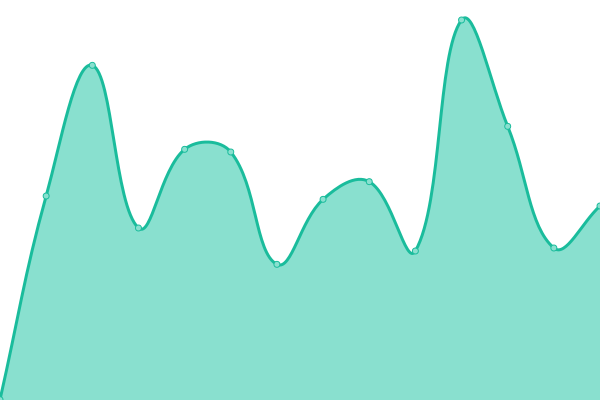

# [📈 Live Status](https://upptime.github.io/upptime): <!--live status--> **🟩 All systems operational**

This repository contains the open-source uptime monitor and status page for [Upptime](https://upptime.js.org), powered by [Upptime](https://github.com/upptime/upptime).

With [Upptime](https://upptime.js.org), you can get your own unlimited and free uptime monitor and status page, powered entirely by a GitHub repository. We use [Issues](https://github.com/upptime/upptime/issues) as incident reports, [Actions](https://github.com/TAKK-Consulting/status/actions) as uptime monitors, and [Pages](https://upptime.github.io/upptime) for the status page.

<!--start: status pages-->
<!-- This summary is generated by Upptime (https://github.com/upptime/upptime) -->
<!-- Do not edit this manually, your changes will be overwritten -->
<!-- prettier-ignore -->
| URL | Status | History | Response Time | Uptime |
| --- | ------ | ------- | ------------- | ------ |
|  [TAKK Consulting](https://www.takkconsulting.co.uk) | 🟩 Up | [takk-consulting.yml](https://github.com/TAKK-Consulting/status/commits/HEAD/history/takk-consulting.yml) | 

 2138ms
     
 | 

<a href="https://status.takkconsulting.co.uk/history/takk-consulting">96.52%</a>
    

|  [CCD Burundi](https://ccdburundi.org.uk) | 🟩 Up | [ccd-burundi.yml](https://github.com/TAKK-Consulting/status/commits/HEAD/history/ccd-burundi.yml) | 

 1467ms
     
 | 

<a href="https://status.takkconsulting.co.uk/history/ccd-burundi">96.70%</a>
    

|  [PlayWood Forest School](https://playwoodforestschool.co.uk) | 🟩 Up | [play-wood-forest-school.yml](https://github.com/TAKK-Consulting/status/commits/HEAD/history/play-wood-forest-school.yml) | 

 1356ms
     
 | 

<a href="https://status.takkconsulting.co.uk/history/play-wood-forest-school">96.71%</a>
    

|  [Tim & Kathy](https://www.timandkathy.co.uk) | 🟩 Up | [tim-and-kathy.yml](https://github.com/TAKK-Consulting/status/commits/HEAD/history/tim-and-kathy.yml) | 

 952ms
     
 | 

<a href="https://status.takkconsulting.co.uk/history/tim-and-kathy">96.72%</a>
    

|  [Bath City Pastors (website)](https://bathcitypastors.org.uk/) | 🟩 Up | [bath-city-pastors-website.yml](https://github.com/TAKK-Consulting/status/commits/HEAD/history/bath-city-pastors-website.yml) | 

 1413ms
     
 | 

<a href="https://status.takkconsulting.co.uk/history/bath-city-pastors-website">96.90%</a>
    

|  [Bath City Pastors (rota app)](https://rota.bathcitypastors.org.uk/) | 🟩 Up | [bath-city-pastors-rota-app.yml](https://github.com/TAKK-Consulting/status/commits/HEAD/history/bath-city-pastors-rota-app.yml) | 

 744ms
     
 | 

<a href="https://status.takkconsulting.co.uk/history/bath-city-pastors-rota-app">100.00%</a>
    

<!--end: status pages-->

[**Visit our status website →**](https://status.takkconsulting.co.uk/)

## 📄 License

- Powered by: [Upptime](https://github.com/upptime/upptime)
- Code: [MIT](./LICENSE) © [Upptime](https://upptime.js.org)
- Data in the `./history` directory: [Open Database License](https://opendatacommons.org/licenses/odbl/1-0/)
